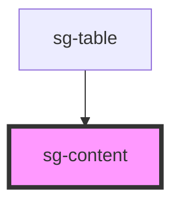

# sg-content

<!-- Auto Generated Below -->

## Properties

| Property    | Attribute   | Description | Type      | Default     |
| ----------- | ----------- | ----------- | --------- | ----------- |
| `dataUrl`   | `data-url`  |             | `string`  | `undefined` |
| `info`      | `info`      |             | `boolean` | `false`     |
| `ordering`  | `ordering`  |             | `boolean` | `false`     |
| `paging`    | `paging`    |             | `boolean` | `false`     |
| `print`     | `print`     |             | `boolean` | `false`     |
| `searching` | `searching` |             | `boolean` | `false`     |
| `theme`     | `theme`     |             | `string`  | `undefined` |

## Dependencies

### Used by

 - [sg-table](../sg-table)

### Graph

----------------------------------------------

*Built with [StencilJS](https://stenciljs.com/)*
